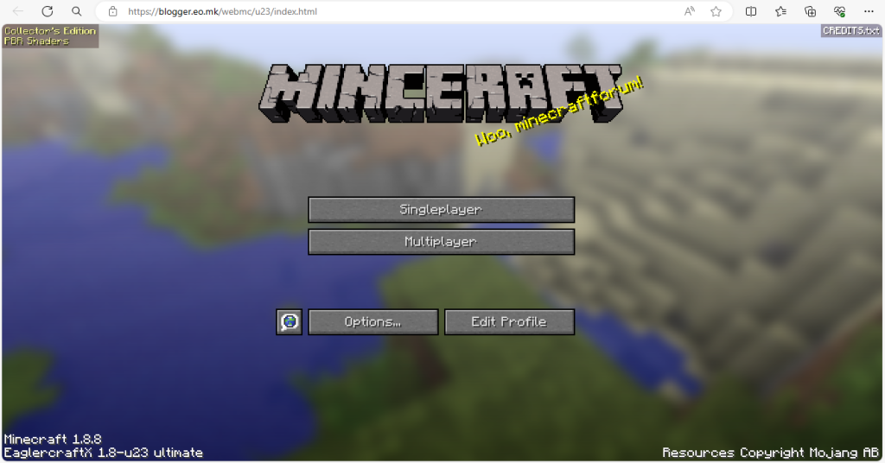
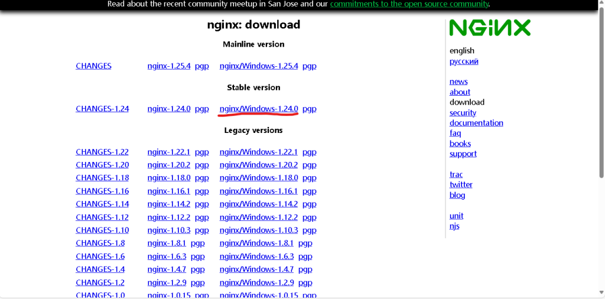
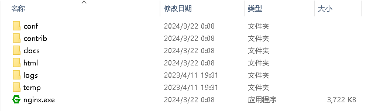
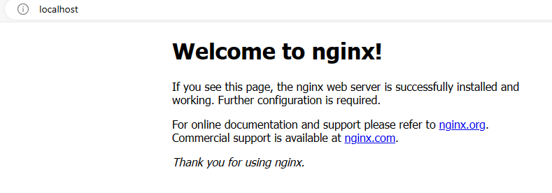
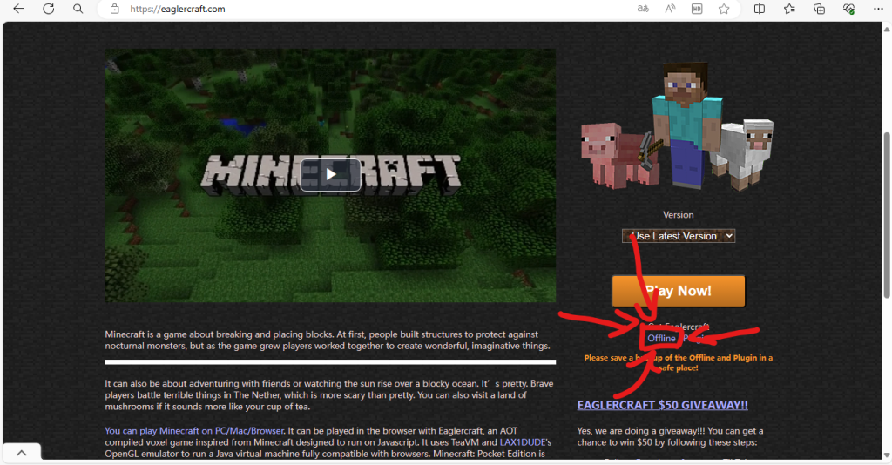
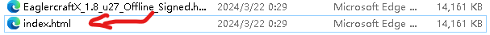
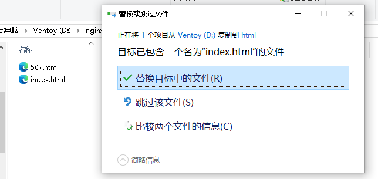

---
浅浅借鉴~剽窃~[一篇文章](https://blog.huang223.top/2024/p=17/)




背景：考虑到有在学校机房玩MC的需求，无奈限于机房的网速，我只能往网页版MC上打主意，然后就看到了GitHub开源的eaglerxcraft。

## 1.在线体验

- 注意事项：
- **仅供个人测试用，严禁用作商业目的。**
- 请勿使用Edge等有右键拖动功能的浏览器，影响游戏体验。
- 游戏延迟较大，恕博主能力有限，请见谅。

```
https://blog.huang223.top/wp-content/uploads/2024/03/EaglercraftX_1_8_u27_Offline_Signed.html
```

## 2.自建教程

注意：本文以Windows操作系统演示

- 材料准备：
- 1. 一台像样的电脑
- 2. 内网穿透服务（除非你有公网IP）
- 3. (可选)一个域名

1.1 本地web服务

前往[nginx官网](https://nginx.org/en/download.html)下载最新版本的构建（Stable version）



将下载下来的压缩包解压到任意目录后，你应该会看到如下的几个文件



双击运行”nginx.exe”，随后打开浏览器，输入”localhost:80″



看到以上提示，则说明nginx已经配置成功了

1.2 配置网页游戏

前往[eaglercraft官网](https://eaglercraft.com/)，点击在”Play Now!”下面的”Offline”，会自动下载一个压缩包



解压包，并将里面的html文件名改为”index.html”



把改名的”index.html”放到nginx解压目录下的”html”文件夹里，替换原有的



然后，重新加载”localhost:80″的页面，你就进入网页版游戏啦！
