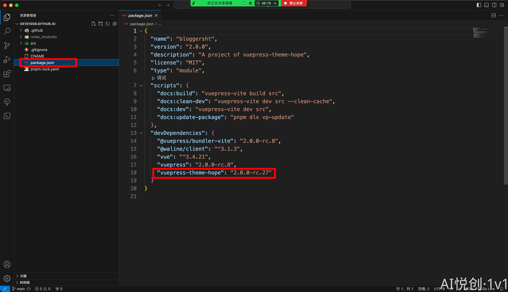
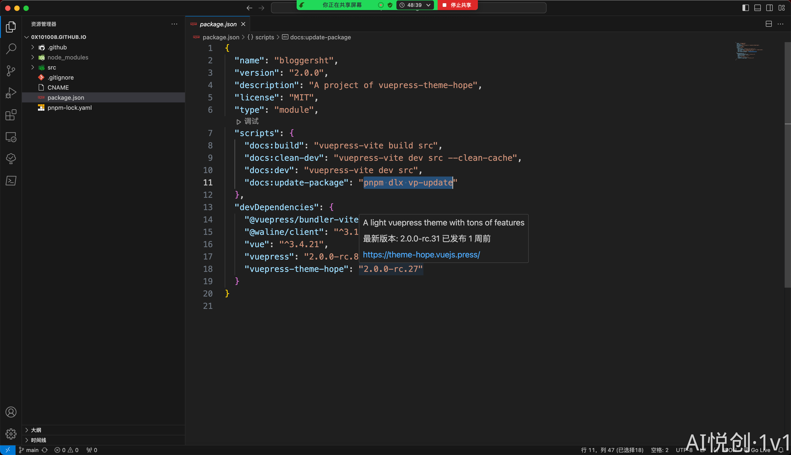
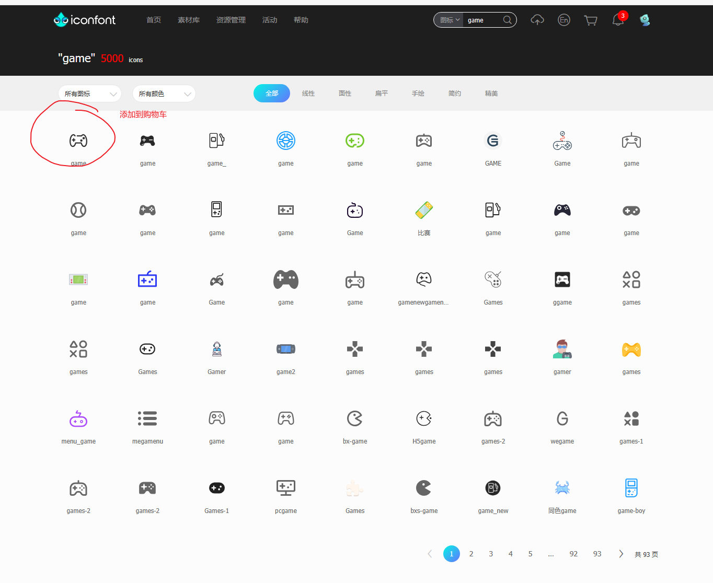
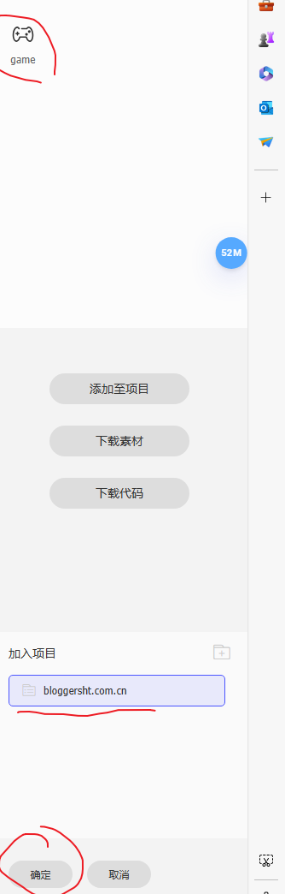
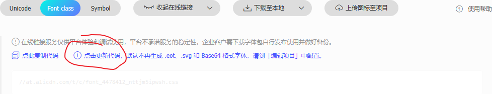
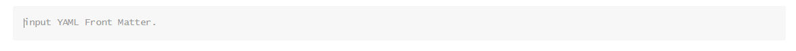

## 1. 个人网站搭建

### 1.1. 升级网站

#### 1.1.1. 怎么看网站有没有发布更新

1. 方法一：访问主题官方文档 https://theme-hope.vuejs.press/changelog.html
2. 怎么看自己网站当前版本？package.json



1. 升级命令：`pnpm dlx vp-update`
2. 方法二：鼠标直接放在上面：



#### 1.1.2. 添加图标








## 2. 文章创建步骤

### 2.1. 创建文件夹

使用文件夹对文章进行分类，文件里面还可以有文件夹，不限层级。`.md`文件

**文件命名规则:**不管是文件夹或者文章文件，文件名称都不能有空格、中文。只能使用英文，如果想要空格就使用减号代替。

**文章文件头部:**文章前面输入三个减号，回车 Enter 就可以出现如下：



**头部内容：**

```plain
title: Markdown
icon: web
date: 2024-03-30 20:50:34
author: sht
isOriginal: true
category: 
    - Web
tag:
    - Web
sticky: false
star: false
article: true
timeline: true
navbar: true
sidebarIcon: true
headerDepth: 5
comment: true
lastUpdated: true
editLink: true
backToTop: true
toc: true
```

时间生成链接：https://bornforthis.cn/python/#/