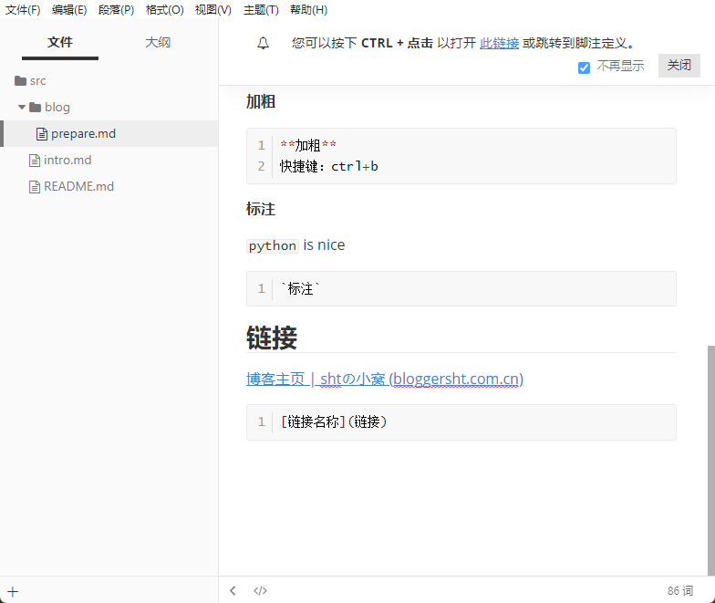

## markdown

### 代码框

```python
print()
```

**加粗**

```python
**加粗**
快捷键：ctrl+b
```

**标注**

`python` is nice

```python
`标注`
```

## 链接

[博客主页 | shtの小窝 (bloggersht.com.cn)](https://bloggersht.com.cn/)

```python
[链接名称](链接)
```

## 图片



- 减号+空格
    1. 有序：一点空格
    2. a
    3. b

## 删除线

~~abcdefg~~

```python
~文字~
```

## 分隔线

---

```python
---
```

## 斜体

_斜体_

```python
_文字_
```

## 标记

::: tip

提示容器

:::

::: info

信息容器

:::

::: important

重要容器

:::

::: warning

警告容器

:::

::: caution

危险容器

:::

::: details

详情容器

:::


## 详情

:::: details

::: tip

提示容器

:::

::: info

信息容器

:::

::: important

重要容器

:::

::: warning

警告容器

:::

::: caution

危险容器

:::

::::

## 代码

::: code-tabs

@tab Code1

```python
print('hello world!')
```

@tab Code2

```python
a=2
b=1
if a>b:
    print(a)
```

@tab Code3

```python
for i in raneg(1,10):
    print('hello world!')
```

:::

## 选项卡

::: tabs

@tab1

aaaaaa

@tab2

bbbbbb

@tab3

cccccc

:::

---


## 勾选

- [x] 减号空格中括号内x,再在外面打字


