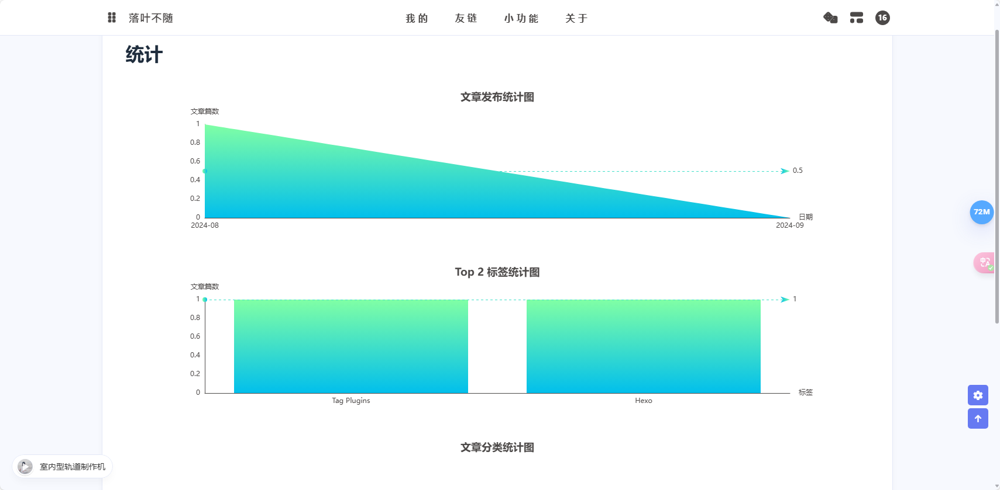

## 1. 效果预览

- [https://blog.bloggersht.com.cn/charts/](https://blog.bloggersht.com.cn.cn/charts/)
- 代码修改参考：[https://github.com/AndersonHJB/AndersonHJB.github.io/commit/a42feb4cde392db0f082945fe14badf7191a7336](https://github.com/AndersonHJB/AndersonHJB.github.io/commit/a42feb4cde392db0f082945fe14badf7191a7336)



## 2. 代码实现

::: tabs

@tab 第一步：添加 charts.js

- 主题目录 `/themes/anzhiyu/scripts/helpers` 下添加一个 `charts.js`

```javascript
// charts.js
const cheerio = require('cheerio')
const moment = require('moment')

hexo.extend.filter.register('after_render:html', function (locals) {
  const $ = cheerio.load(locals)
  const post = $('#posts-chart')
  const tag = $('#tags-chart')
  const category = $('#categories-chart')
  const htmlEncode = false

  if (post.length > 0 || tag.length > 0 || category.length > 0) {
    if (post.length > 0 && $('#postsChart').length === 0) {
      if (post.attr('data-encode') === 'true') htmlEncode = true
      post.after(postsChart(post.attr('data-start')))
    }
    if (tag.length > 0 && $('#tagsChart').length === 0) {
      if (tag.attr('data-encode') === 'true') htmlEncode = true
      tag.after(tagsChart(tag.attr('data-length')))
    }
    if (category.length > 0 && $('#categoriesChart').length === 0) {
      if (category.attr('data-encode') === 'true') htmlEncode = true
      category.after(categoriesChart(category.attr('data-parent')))
    }

    if (htmlEncode) {
      return $.root().html().replace(/&amp;#/g, '&#')
    } else {
      return $.root().html()
    }
  } else {
    return locals
  }
}, 15)

function postsChart (startMonth) {
  const startDate = moment(startMonth || '2020-01')
  const endDate = moment()

  const monthMap = new Map()
  const dayTime = 3600 * 24 * 1000
  for (let time = startDate; time <= endDate; time += dayTime) {
    const month = moment(time).format('YYYY-MM')
    if (!monthMap.has(month)) {
      monthMap.set(month, 0)
    }
  }
  hexo.locals.get('posts').forEach(function (post) {
    const month = post.date.format('YYYY-MM')
    if (monthMap.has(month)) {
      monthMap.set(month, monthMap.get(month) + 1)
    }
  })
  const monthArr = JSON.stringify([...monthMap.keys()])
  const monthValueArr = JSON.stringify([...monthMap.values()])

  return `
  <script id="postsChart">
    var color = document.documentElement.getAttribute('data-theme') === 'light' ? '#4c4948' : 'rgba(255,255,255,0.7)'
    var postsChart = echarts.init(document.getElementById('posts-chart'), 'light');
    var postsOption = {
      title: {
        text: '文章发布统计图',
        x: 'center',
        textStyle: {
          color: color
        }
      },
      tooltip: {
        trigger: 'axis'
      },
      xAxis: {
        name: '日期',
        type: 'category',
        boundaryGap: false,
        nameTextStyle: {
          color: color
        },
        axisTick: {
          show: false
        },
        axisLabel: {
          show: true,
          color: color
        },
        axisLine: {
          show: true,
          lineStyle: {
            color: color
          }
        },
        data: ${monthArr}
      },
      yAxis: {
        name: '文章篇数',
        type: 'value',
        nameTextStyle: {
          color: color
        },
        splitLine: {
          show: false
        },
        axisTick: {
          show: false
        },
        axisLabel: {
          show: true,
          color: color
        },
        axisLine: {
          show: true,
          lineStyle: {
            color: color
          }
        }
      },
      series: [{
        name: '文章篇数',
        type: 'line',
        smooth: true,
        lineStyle: {
            width: 0
        },
        showSymbol: false,
        itemStyle: {
          opacity: 1,
          color: new echarts.graphic.LinearGradient(0, 0, 0, 1, [{
            offset: 0,
            color: 'rgba(128, 255, 165)'
          },
          {
            offset: 1,
            color: 'rgba(1, 191, 236)'
          }])
        },
        areaStyle: {
          opacity: 1,
          color: new echarts.graphic.LinearGradient(0, 0, 0, 1, [{
            offset: 0,
            color: 'rgba(128, 255, 165)'
          }, {
            offset: 1,
            color: 'rgba(1, 191, 236)'
          }])
        },
        data: ${monthValueArr},
        markLine: {
          data: [{
            name: '平均值',
            type: 'average',
            label: {
              color: color
            }
          }]
        }
      }]
    };
    postsChart.setOption(postsOption);
    window.addEventListener('resize', () => {
      postsChart.resize();
    });
    postsChart.on('click', 'series', (event) => {
      if (event.componentType === 'series') window.location.href = '/archives/' + event.name.replace('-', '/');
    });
  </script>`
}

function tagsChart (len) {
  const tagArr = []
  hexo.locals.get('tags').map(function (tag) {
    tagArr.push({ name: tag.name, value: tag.length, path: tag.path })
  })
  tagArr.sort((a, b) => { return b.value - a.value })

  const dataLength = Math.min(tagArr.length, len) || tagArr.length
  const tagNameArr = []
  for (let i = 0; i < dataLength; i++) {
    tagNameArr.push(tagArr[i].name)
  }
  const tagNameArrJson = JSON.stringify(tagNameArr)
  const tagArrJson = JSON.stringify(tagArr)

  return `
  <script id="tagsChart">
    var color = document.documentElement.getAttribute('data-theme') === 'light' ? '#4c4948' : 'rgba(255,255,255,0.7)'
    var tagsChart = echarts.init(document.getElementById('tags-chart'), 'light');
    var tagsOption = {
      title: {
        text: 'Top ${dataLength} 标签统计图',
        x: 'center',
        textStyle: {
          color: color
        }
      },
      tooltip: {},
      xAxis: {
        name: '标签',
        type: 'category',
        nameTextStyle: {
          color: color
        },
        axisTick: {
          show: false
        },
        axisLabel: {
          show: true,
          color: color,
          interval: 0
        },
        axisLine: {
          show: true,
          lineStyle: {
            color: color
          }
        },
        data: ${tagNameArrJson}
      },
      yAxis: {
        name: '文章篇数',
        type: 'value',
        splitLine: {
          show: false
        },
        nameTextStyle: {
          color: color
        },
        axisTick: {
          show: false
        },
        axisLabel: {
          show: true,
          color: color
        },
        axisLine: {
          show: true,
          lineStyle: {
            color: color
          }
        }
      },
      series: [{
        name: '文章篇数',
        type: 'bar',
        data: ${tagArrJson},
        itemStyle: {
          borderRadius: [5, 5, 0, 0],
          color: new echarts.graphic.LinearGradient(0, 0, 0, 1, [{
            offset: 0,
            color: 'rgba(128, 255, 165)'
          },
          {
            offset: 1,
            color: 'rgba(1, 191, 236)'
          }])
        },
        emphasis: {
          itemStyle: {
            color: new echarts.graphic.LinearGradient(0, 0, 0, 1, [{
              offset: 0,
              color: 'rgba(128, 255, 195)'
            },
            {
              offset: 1,
              color: 'rgba(1, 211, 255)'
            }])
          }
        },
        markLine: {
          data: [{
            name: '平均值',
            type: 'average',
            label: {
              color: color
            }
          }]
        }
      }]
    };
    tagsChart.setOption(tagsOption);
    window.addEventListener('resize', () => {
      tagsChart.resize();
    });
    tagsChart.on('click', 'series', (event) => {
      if(event.data.path) window.location.href = '/' + event.data.path;
    });
  </script>`
}

function categoriesChart (dataParent) {
  const categoryArr = []
  let categoryParentFlag = false
  hexo.locals.get('categories').map(function (category) {
    if (category.parent) categoryParentFlag = true
    categoryArr.push({
      name: category.name,
      value: category.length,
      path: category.path,
      id: category._id,
      parentId: category.parent || '0'
    })
  })
  categoryParentFlag = categoryParentFlag && dataParent === 'true'
  categoryArr.sort((a, b) => { return b.value - a.value })
  function translateListToTree (data, parent) {
    let tree = []
    let temp
    data.forEach((item, index) => {
      if (data[index].parentId == parent) {
        let obj = data[index];
        temp = translateListToTree(data, data[index].id);
        if (temp.length > 0) {
          obj.children = temp
        }
        if (tree.indexOf())
          tree.push(obj)
      }
    })
    return tree
  }
  const categoryNameJson = JSON.stringify(categoryArr.map(function (category) { return category.name }))
  const categoryArrJson = JSON.stringify(categoryArr)
  const categoryArrParentJson = JSON.stringify(translateListToTree(categoryArr, '0'))

  return `
  <script id="categoriesChart">
    var color = document.documentElement.getAttribute('data-theme') === 'light' ? '#4c4948' : 'rgba(255,255,255,0.7)'
    var categoriesChart = echarts.init(document.getElementById('categories-chart'), 'light');
    var categoryParentFlag = ${categoryParentFlag}
    var categoriesOption = {
      title: {
        text: '文章分类统计图',
        x: 'center',
        textStyle: {
          color: color
        }
      },
      legend: {
        top: 'bottom',
        data: ${categoryNameJson},
        textStyle: {
          color: color
        }
      },
      tooltip: {
        trigger: 'item'
      },
      series: []
    };
    categoriesOption.series.push(
      categoryParentFlag ?
      {
        nodeClick :false,
        name: '文章篇数',
        type: 'sunburst',
        radius: ['15%', '90%'],
        center: ['50%', '55%'],
        sort: 'desc',
        data: ${categoryArrParentJson},
        itemStyle: {
          borderColor: '#fff',
          borderWidth: 2,
          emphasis: {
            focus: 'ancestor',
            shadowBlur: 10,
            shadowOffsetX: 0,
            shadowColor: 'rgba(255, 255, 255, 0.5)'
          }
        }
      }
      :
      {
        name: '文章篇数',
        type: 'pie',
        radius: [30, 80],
        roseType: 'area',
        label: {
          color: color,
          formatter: '{b} : {c} ({d}%)'
        },
        data: ${categoryArrJson},
        itemStyle: {
          emphasis: {
            shadowBlur: 10,
            shadowOffsetX: 0,
            shadowColor: 'rgba(255, 255, 255, 0.5)'
          }
        }
      }
    )
    categoriesChart.setOption(categoriesOption);
    window.addEventListener('resize', () => {
      categoriesChart.resize();
    });
    categoriesChart.on('click', 'series', (event) => {
      if(event.data.path) window.location.href = '/' + event.data.path;
    });
  </script>`
}
```

@tab 第二步：插入 js 到 Inject

- `_config.anzhiyu.yml` 文件中搜 Inject 插入到 bottom

```yaml
<script src="https://cdn.bootcdn.net/ajax/libs/echarts/4.9.0-rc.1/echarts.min.js"></script>
```

例子：

```yaml
# Inject
# Insert the code to head (before '</head>' tag) and the bottom (before '</body>' tag)
# 插入代码到头部 </head> 之前 和 底部 </body> 之前
inject:
  head:
  bottom:
      - <script src="https://cdn.bootcdn.net/ajax/libs/echarts/4.9.0-rc.1/echarts.min.js"></script>
```

@tab 第三步： 新建一个统计页面

```bash
hexo new page charts
```

前往博客根目录下 `source/charts/index.md`，修改内容如下：

```markdown
---
title: 统计
type: "charts"
comments: false
aside: false
---

<script src="https://cdn.bootcdn.net/ajax/libs/echarts/4.9.0-rc.1/echarts.min.js"></script>

<!-- 文章发布时间统计图 --> <!-- 2020-02是从2020年2月开始计算 -->
<div id="posts-chart" data-start="2020-02" style="border-radius: 8px; height: 300px; padding: 10px;"></div>
<!-- 文章标签统计图 --> <!-- data-length="10" 是显示的标签数量 -->
<div id="tags-chart" data-length="10" style="border-radius: 8px; height: 300px; padding: 10px;"></div>
<!-- 文章分类统计图 -->
<div id="categories-chart" data-parent="true" style="border-radius: 8px; height: 300px; padding: 10px;"></div>
```


:::