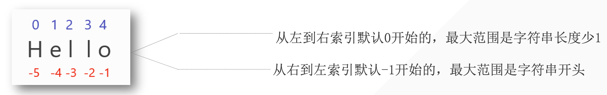
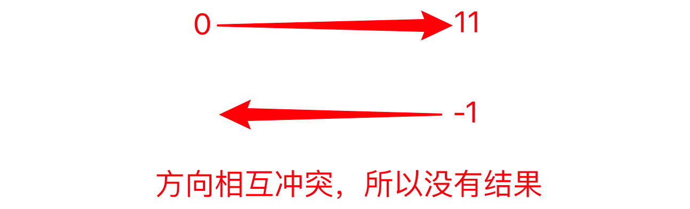
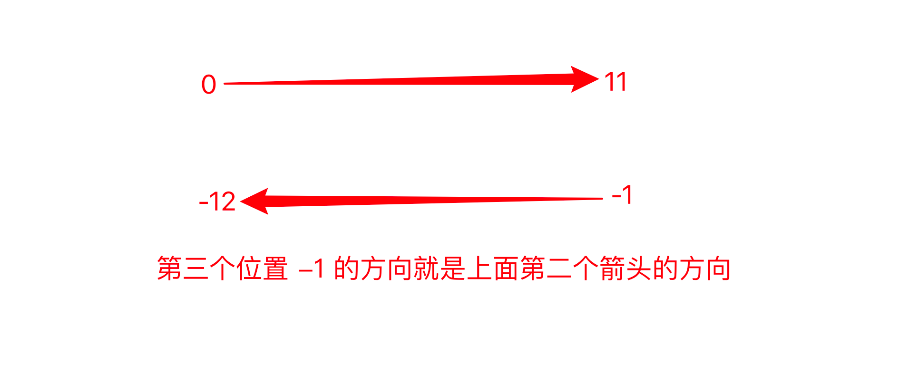

---

### 1.字符串的定义

字符串是由字母、数字、特殊字符来组成的序列。



### 2.如何创建字符串

如何创建字符串？

——使用**<span style='color:orange'>单引号、双引号</span>**或者**<span style='color:orange'>三引号</span>**。

```python
name = 'sht'
num = 31
para = '''hello world'''
para_two = """hello world"""
```

*为什么python同时支持三种创建字符串的方法？*

常见的：

```
string='I am sht.'
print(string)
```
但在英语中也可以这样表达：


```python
string='I'm sht.'
print(string)

#output

  File "C:\Users\s\Desktop\编程\代码\python\str.py", line 1
    string='I'm sht.'
              ^
SyntaxError: invalid syntax
```

##### 因为，开头是单引号，所以Python会寻找下一个第一次出现的单引号进行匹配。而第一个单引号不在字符串末尾，所以会导致整个字符串异常。

如果是长文本呢？

方法一

```python
string='我们有时候不仅仅要看选择项以内的答案，也要去思考选择项以外的答案。\
\
浅者见浅，深者见深\
\
起的最早的是理想主义者，跑的最快的是骗子，而胆子最大的是那些冒险家，害怕错过一切，疯狂往里冲的是韭菜，而真正的成功者，可能还没有入场。\
\
先实现功能，再去优化，否则一切会很乱。\
\
凡是你不能清晰写下来的东西，都是你还没有真正理解的东西'
print(string)
```

但这样就会导致输出在一行当中，所以有了方法二——三引号

```python
string='''我们有时候不仅仅要看选择项以内的答案，也要去思考选择项以外的答案。

浅者见浅，深者见深

起的最早的是理想主义者，跑的最快的是骗子，而胆子最大的是那些冒险家，害怕错过一切，疯狂往里冲的是韭菜，而真正的成功者，可能还没有入场。

先实现功能，再去优化，否则一切会很乱。

凡是你不能清晰写下来的东西，都是你还没有真正理解的东西'''
print(string)

#output

我们有时候不仅仅要看选择项以内的答案，也要去思考选择项以外的答案。

浅者见浅，深者见深

起的最早的是理想主义者，跑的最快的是骗子，而胆子最大的是那些冒险家，害怕错过一切，疯狂往里冲的是韭菜，而真正的成功者，可能还没有入场。

先实现功能，再去优化，否则一切会很乱。

凡是你不能清晰写下来的东西，都是你还没有真正理解的东西
```

可以从上面的输出可知，原本什么格式，输出就是什么格式「原样输出」「三个单引号的效果和前面一样」

- **<span style='color:orange'>三个单引号或者三个双引号，实现原样输出。</span>**
- **<span style='color:orange'>多行注释</span>**
- **<span style='color:orange'>单双三引号混用</span>**

## 3.字符串长度

如何获取一个字符串的长度呢？——`len()`

`len()`:返回字符串中字符长度或字符数。

```python
string='sht'
print(string)
#s
select=string[0]
print(select)
#t
select=string[2]
select1=string[-1]
select2=string[len(string)-1]
print(select,select1,select2)

#output
sht
s
t t t
```

### 3.2获取多个连续字符「子字符」

```python
string='sht'
select=string[1:3]
print(select)

#output
ht

'''
语法：
string='sht'
select=string[start:end]
end要减1
print(select)
'''
```

```python
string='sht114514'
select=string[3:10]
select1=string[0:3]
select2=string[-6:-1]
print(select,select1,select2)

#output
114514 sht 11451
```

### 3.3 获取多个不连续的字符

```python
#h141
string='sht114514'
select=string[1:10:2]
print(select)
#13579
string1='0123456789'
select1=string1[1:11:2]
print(select1)

#output
h141
13579
```

### 3.4优化

```python
string='0123456789'
#02468
select=string[::2]
print(select)
#13579
select1=string[1::2]
print(select1)

'''
output
02468
13579
'''
```

### 3.5字符串倒序

字符串的第三个位置，控制的是字符串提取的方向。默认为正数1，如果我们改为-1，就会变成反方向。

::: warning

正负控制方向，数字大小控制步长。

:::

```python
string='01234567891'
select=string[::-1]
print(select)

#output
19876543210
```

::: tip

思考一下，上面少了什么？

:::

想必你也发现了，没有结果也没有报错。

Why?



由上面分析，我们应该如何解决？

##### 解决方法

- 方法一：调换位置

    - 能否解决：可以

    - 存在什么问题：少了一个字符

    - ```python
        string='01234567891'
        select=string[11:0:-1]
        print(select)
        #1987654321
        ```

为什么少了一个字符？

——存在一个悖论，因为结束🔚是0，但是`0+1`时得到1，而1是从左到右的第二个字符。故而+1是无法实现和解决的。

但是我们可以利用不写结尾，得到最后一个缺失的字符：`string[11::-1]`。

虽然解决，但是我们偏离了一开始的问题：前两位省略了什么数字？「因为，又回到了一开始省略的状态了」

- 方法二：重写开始结尾

    - 想想字符串的有序性，从右到左。

    - 为什么要纠结前面两个空的数字是多少？——为了之后得到某一部分的字符倒序。

    - ```python
        string='01234567891'
        select=string[-1:12:-1]
        print(select)
        ```



### 小试牛刀：提取`6543`

```python
string='01234567891'
select=string[-5:-9:-1]
print(select)
```

---

### 4.字符串内置方法

#### 4.1 upper()

大写字符串

```python
string='shtnb'
up_string=string.upper()
print(up_string)
print(string)
#output
SHTNB
shtnb
```

#### 4.2 lower()

小写字符串

```python
string='SHTNB'
lower_string=string.lower()
print(lower_string)
print(string)

#output
shtnb
SHTNB
```

#### 4.3 capitalize()

首字母大写

```python
string='shtnb To Hp'
capitalize_string=string.capitalize()
print(capitalize_string)
print(string)

#output
Shtnb to hp
shtnb to hp
```

#### 4.4 title()

将每个词首字母大写

`不论什么间隔，都会转为首字母大写。其余字符都转为小写。`

```python
string='shtnb to hp'
title_string=string.title()
print(title_string）

string='shtnb-to-hp'
title_string=string.title()
print(title_string)

#output
Shtnb To Hp
Shtnb-To-Hp
```

#### 4.5 startswith()

检测字符串开头是否为特定字符开头，返回布尔值。

```python
string='shtnb'
startswith_string=string.startswith('s')
print(startswith_string)

string='shtnb'
startswith_string=string.startswith('h')
print(startswith_string)

#output
True
False
```

#### 4.6 endswith()

检测字符串开头是否为特定字符开头，返回布尔值。

```python
string='shtnb'
endswith_string=string.endswith('b')
print(endswith_string)

string='shtnb'
endswith_string=string.endswith('h')
print(endswith_string)

#output
True
False
```

#### 4.7 count()

计算特定字符或单词在目标字符串中存在的次数。

```python
string='luoyebusui'
count=string.count('u')
print(count)

#output
3
```

#### 4.8 find()

寻找目标字符或单词在特定字符串中第一次出现的下标。「及时重复出现也只返回第一次的」如果是查找单词，则它会返回目标单词的第一个字符的下标。

如果查询的字符不存在则返回`-1`。

```python
string='luoyebusui'
print(string.find('u'))

string='luoyebusui'
print(string.find('ye'))

string='luoyebusui'
print(string.find('z'))

#output
1
3
-1
```

#### 4.9 index()

寻找目标字符或单词在特定字符串中第一次出现的下标。如果是查找单词，那么就返回目标的第一个字符的下标。

如果不存在，则报错。

```python
string='luoyebusui'
print(string.index('u'))

string='luoyebusui'
print(string.index('ye'))

string='luoyebusui'
print(string.index('z'))

#output
1
3
Traceback (most recent call last):
  File "C:\Users\s\Desktop\编程\代码\python\str.py", line 8, in <module>
    print(string.index('z'))
ValueError: substring not found
```

#### 4.10 isalpha()

判断字符串是不是纯字母字符串，字符串中但凡有一个字符是非字母，则返回false

```python
string = 'luoyebusui'
isalpha = string.isalpha()
print(isalpha)

string = 'luoye busui'
isalpha = string.isalpha()
print(isalpha)

#output
True
False
```

#### 4.11 isdigit()

判断字符串是不是纯数字字符串，字符串中但凡有一个字符是非数字，则返回false

```python
string = '12345678'
isdigit = string.isdigit()
print(isdigit)

string = '1234 5678'
isdigit = string.isdigit()
print(isdigit)

#output
True
False
```

#### 4.12 isalnum()

判断字符串是不是纯数字、纯字母或纯数字字母字符串，字符串中但凡有一个字符是非数字、字母元素，则返回false

```python
string = 'luoyebusui'
isalnum= string.isalnum()
print(isalnum)

string = '888'
isalnum= string.isalnum()
print(isalnum)

string = 'luoyebusui888'
isalnum= string.isalnum()
print(isalnum)

string = 'luoyebusui 888'
isalnum= string.isalnum()
print(isalnum)
#output
True
True
True
False
```

#### 4.13 isupper()

判断字符串中的字母是否全是大写，全大写返回true，负责返回false

```python
string = "LUOYEBUSUI"
isupper = string.isupper()
print(isupper)

string = 'LUOYEBUSUI111-'
isupper = string.isupper()
print(isupper)

string = "LUOYEbusui"
isupper = string.isupper()
print(isupper)

string = "luoyebusui"
isupper = string.isupper()
print(isupper)
# output
True
True
False
False
```

#### 4.14 islower()

判断字符串中的字母是否全是小写，全小写返回true，负责返回false

```python
string='luoyebusui'
islower=string.islower()
print(islower)

string='luoyebusui111-'
islower=string.islower()
print(islower)

string='luoyebusuiA111-'
islower=string.islower()
print(islower)
# output
True
True
False
```

#### 4.15 isspace()

判断字符串是不是纯空格，多少个空格都可以。纯空格返回True,负责返回False

```python
string = '     '
isspace = string.isspace()
print(isspace)

string = ''
isspace = string.isspace()
print(isspace)

string = 'aaa'
isspace = string.isspace()
print(isspace)
#output
True
False
False
```

#### 4.16 strip()

默认去掉目标字符串的前后空白字符，如果指定参数，则去掉指定字符。

```python
string ='   luoyebusui   '
strip = string.strip()
print(string)
print(strip)

string ='---luoyebusui---'
strip = string.strip('-')
print(string)
print(strip)

string ='-- ---luoyebusui--- ---'
strip = string.strip('-')
print(string)
print(strip)

string ='-- ---luoyebusui--- ---'
strip = string.strip('- ')
print(string)
print(strip)

string ='-- ---luoyebusui--- ---'
strip = string.strip(' -')
print(string)
print(strip)

#output
   luoyebusui   
luoyebusui
---luoyebusui---
luoyebusui
-- ---luoyebusui--- ---
 ---luoyebusui--- 
-- ---luoyebusui--- ---
luoyebusui
-- ---luoyebusui--- ---
luoyebusui
```

#### 4.18 rstrip()

默认去掉字符串右边的空白字符，如果指定参数，则去掉右边的指定字符。

```python
string ='   luoyebusui   '
rstrip = string.rstrip()
print(string)
print(rstrip)

string ='---luoyebusui---'
rstrip = string.rstrip('-')
print(string)
print(rstrip)

string ='-- ---luoyebusui--- ---'
rstrip = string.rstrip('-')
print(string)
print(rstrip)

string ='-- ---luoyebusui--- ---'
rstrip = string.rstrip('- ')
print(string)
print(rstrip)

string ='-- ---luoyebusui--- ---'
rstrip = string.rstrip(' -')
print(string)
print(rstrip)

#output
   luoyebusui   
   luoyebusui
---luoyebusui---
---luoyebusui
-- ---luoyebusui--- ---
-- ---luoyebusui--- 
-- ---luoyebusui--- ---
-- ---luoyebusui
-- ---luoyebusui--- ---
-- ---luoyebusui
```

#### 4.19 replace()

`.replace(old,new,count)`第一个位置传入待替换的旧「old」字符，将第二个位置传入要替换的新字符「new」，默认替换全部，count控制次数。

```python
string ='   luoyebusui   '
replace_string=string.replace(' ','*')
print(string)
print(replace_string)

#output
   luoyebusui   
***luoyebusui***


string ='ai-luoyebusui-ai'
replaced_string = string.replace('ai', 'love')
print(string)
print(replaced_string)

#output
ai-luoyebusui-ai
love-luoyebusui-love


string ='ai-luoyebusui-ai'
replaced_string = string.replace('ai', 'love',1)
print(string)
print(replaced_string)

#output
ai-luoyebusui-ai
love-luoyebusui-ai
```

#### 4.20 split()

`.split(sep,maxsplit)`以特定字符进行分割，默认空格分割。如果传入参数「sep」，则以参数进行分割。返回分割后的列表。maxsplit用于控制分割几次。

```python
string ='ai luoyebusui ai'
split_string = string.split()
print(string)
print(split_string)

#output
ai luoyebusui ai
['ai', 'luoyebusui','ai']


string ='ai-luoyebusuiai-ai'
split_string = string.split('-')
print(string)
print(split_string)

#output
ai-luoyebusuiai-ai
['ai', 'luoyebusuiai', 'ai']


string ='ai-luoyebusuiai-love'
split_string = string.split('-',1)
print(string)
print(split_string)

#output
ai-luoyebusuiai-love
['ai', 'luoyebusuiai-love']
```

::: warning 

注意⚠️：使用split分割时，不管每个字符之间有几个空格都会正常分割出来。

```python
string ='ai         luoyebusuiai         love'
split_string = string.split()
print(split_string)

#output
['ai', 'luoyebusuiai', 'love']
```

当我们指定split的间隔时，split会严格按照我们指定的分割符号来分割。

```python
string ='ai         luoyebusuiai         love'
split_string = string.split(' ')
print(split_string)

#output
['ai', '', '', '', '', '', '', '', '', 'luoyebusuiai', '', '', '', '', '', '', '', '', 'love']
```

上面多输出的结果空字符串，就是证明。

其实，在学习过程中，还是需要经常举一反三的。如果是其他的连续字符串会不会有这种情况？——答案是肯定的，也会有这样的情况。

:::

#### 5.21 rsplit()

`.rsplit(sep,maxsplit)`从字符串右边进行分割，也可以传入参数「sep」，进行指定分割。返回分割后的列表。maxsplit指定分割次数。

```python
string ='ai-luoyebusuiai-love'
split_string = string.split('-')
print(string)
print(split_string)

#output
ai-luoyebusuiai-love
['ai', 'luoyebusuiai', 'love']


string ='ai-luoyebusuiai-love'
split_string = string.split('-',1)
print(string)
print(split_string)

#output
ai-luoyebusuiai-love
['ai', 'luoyebusuiai-love']
```

####  5.22 join()

以特定字符使字符串间隔。

```python
string='luoyebusui'
joined_string='-'.join(string)
print(string)
print(joined_string)

#output
luoyebusui
l-u-o-y-e-b-u-s-u-i
```

##  6.字符串格式化

```python
string='Luoyebusui,welcome to Suzhou!'
print(string)

#output
Luoyebusui,welcome to Suzhou!
```

- 所存在的问题：需要换一个人名或地区，就需要重新创建一个全新的字符串。

- 我们更希望有类似的模板，让不同的人名、地名填写进去。而不是每个人都重头创建一个新字符串。

当然这个时候有可能会想到使用字符串的加法，但字符串加法存在问题。
```python
name='luoyebusui'
region='Suzhou'
string1='Hi '
string2=',welcome to '
string3='.'
result=string1+name+string2+region+string3
print(result)

#output
Hi luoyebusui,welcome to Suzhou.
```

#### 6.1 format（）

1.单个花括号`{}`

```python
string='Hi {},welcome to Suzhou.'.format('luoyebusui')
print(string)

#output
Hi luoyebusui,welcome to Suzhou.

string='Hi {},welcome to Suzhou.'
print(string.format('luoyebusui'))

#output
Hi luoyebusui,welcome to Suzhou.

string='Hi {},welcome to Suzhou.'
new_string=string.format('luoyebusui')
print(new_string)

#output
Hi luoyebusui,welcome to Suzhou.
```

2.一个花括号以上「按顺序填充」

```python
string='Hi {},welcome to {}.'.format('luoyebusui','Suzhou')
print(string)

#output
Hi luoyebusui,welcome to Suzhou.

string='Hi {},welcome to {}.'
print(string.format('luoyebusui','Suzhou'))

#output
Hi luoyebusui,welcome to Suzhou.

string='Hi {},welcome to {}.'
new_string=string.format('luoyebusui','Suzhou')
print(new_string)

#output
Hi luoyebusui,welcome to Suzhou.
```

3.多个花括号指定位置

```python
string='Hi {1},welcome to {0}.'.format('Suzhou','luoyebusui')
print(string)

#output
Hi luoyebusui,welcome to Suzhou.

string='Hi {1},welcome to {0}.'
print(string.format('Suzhou','luoyebusui'))

#output
Hi luoyebusui,welcome to Suzhou.

string='Hi {1},welcome to {0}.'
new_string=string.format('Suzhou','luoyebusui')
print(new_string)

#output
Hi luoyebusui,welcome to Suzhou.
```

4.参数指定

```python
string='Hi {name},welcome to {region}.'.format(region='Suzhou',name='luoyebusui')
print(string)

#output
Hi luoyebusui,welcome to Suzhou.

string='Hi {name},welcome to {region}.'
print(string.format(region='Suzhou',name='luoyebusui'))

#output
Hi luoyebusui,welcome to Suzhou.

string='Hi {name},welcome to {region}.'
new_string=string.format(region='Suzhou',name='luoyebusui')
print(new_string)

#output
Hi luoyebusui,welcome to Suzhou.
```

5.保留指定小数位

```python
string='Money is {:.3f}.'.format(190)
print(string)

#output
Money is 190.000.
```

#### 6.2 f

1.直接读取变量

```python
name='luoyebusui'
region='suzhou'
string=f'my name is {name} and i live in {region}'
print(string)

#output
my name is luoyebusui and i live in suzhou
```

2.保留小数位

```python
money=100
string=f'I have {money:.3f} dollars'
print(string)

#output
I have 100.000 dollars
```

#### 6.3 %格式化

- `%d`：整数
- `%s`：字符串
- `%f`：浮点数

1.单个位置传入

```python
string='money is %d'
new_s=string%13
print(new_s)
print(string%19)
string='money is %d' % 190
print(string)

#output
money is 13
money is 19
money is 190
```

2.多个位置传入

```python
string='money is %d %s'
new_S=string % (13,'发大财')
print(new_S)
print(string % (888,'暴富'))
string='money is %d %s' % (198,'超有钱')
print(string)

#output
money is 13 发大财
money is 888 暴富
money is 198 超有钱
```

3,保留小数位

```python
string='money is %.3f'
new= string % 19
print(new)
print(string % 10)
string='money is %.3f' %100
print(string)

#output
money is 19.000
money is 10.000
money is 100.000
```

#### 6.4 f、format和%的优缺点

`format` 和`%`都像模版，提前做好模板后面有需要时可以直接用；而`f`则是像在银行中，柜员边问你边登记，不能提前做好模板。

## 7.字符串不可变性

字符串是不可变的，不可以改变字符串中的任何元素，如需改变字符串的元素，则需要新创建一个字符串。

```python
s='hello luoyebusui'
s[0]='a'

#output
Traceback (most recent call last):
  File "C:\Users\s\Desktop\编程\代码\python\str.py", line 2, in <module>
    s[0]='a'
TypeError: 'str' object does not support item assignment

```

除了使用replace还可以使用字符串拼接：

```python
s='hello luoyebusui'
new='a'+s[1:]
print(new)

#output
aello luoyebusui
```

## 8.字符串转义

| 转义字符 |              含义               |         例子          |
| :------: | :-----------------------------: | :-------------------: |
|   `\\`   | 反斜杠符号为了在字符串中得到`\` |  `s='luoye\\busui'`   |
|   `\b`   |       退格，类似于删除键        |  `s='luoyebb\usui'`   |
|   `\n`   |              换行               |  `s='luoye\nbusui'`   |
|   `\t`   |             制表符              | `s='luoye\tbu\tsui'`  |
|   `r`    |     取消转义「R和r」都可以      | `s=r'luoye\tbu\tsui'` |

```python
s='luoye\\busui'
print(s)

s='luoye\bbusui'
print(s)

s='luoye\nbusui'
print(s)

s='luoye\tbu\tsui'
print(s)

#output
luoye\busui
luoybusui
luoye
busui
luoye	bu	sui
```

## 9.字符串的连接

```python
s='luoye'
s2='busui'
print(s+s2)
print(s,s2)

#output
luoyebusui
luoye busui
```

```python
s='*love*'
print(s*10)

#output
*love**love**love**love**love**love**love**love**love**love*
```

```python
s='*love*'
print(s*10,end='*')

#output
*love**love**love**love**love**love**love**love**love**love**
```

## 10.读取用户输入

#### 10.1 input（）基本使用

使用`input()`获取用户输入

```python
userinput=input()
print(userinput)

#output
hahaha
hahaha
```

```python
userinput=input('name>')
print('name:',userinput)

#output
name>sht
name: sht
```

#### 10.2 input()得到的类型皆为字符串「str」

```python
In [1]: type(input('>>>'))
>>>sht
Out[1]: str

In [2]: type(input('>>>'))
>>>123
Out[2]: str

In [3]: type(input('>>>'))
>>>[1,2,3,4,5]
Out[3]: str

In [4]: type(input('>>>'))
>>>(1,2,3)  
Out[4]: str

In [5]: type(input('>>>'))
>>>{'a':1,'b':2}
Out[5]: str

In [6]: type(input('>>>'))
>>>True
Out[6]: str

In [7]: type(input('>>>'))
>>>12.3
Out[7]: str

In [8]: type(input('>>>'))
>>>{1,2,3,4}
Out[8]: str
```

#### 10.3 input()类型转换

##### 方法一：强制转换

```python
In [9]: n=int(input())
12

In [10]: type(n)
Out[10]: int

In [11]: n
Out[11]: 12

In [12]: n=float((input()))
12.9

In [13]: type(n)
Out[13]: float

In [14]: n
Out[14]: 12.9

In [15]: n=list((input()))
[1,2,3,4]

In [16]: type(n)
Out[16]: list

In [17]: n
Out[17]: ['[', '1', ',', '2', ',', '3', ',', '4', ']']

In [18]: n=bool((input()))
True

In [19]: type(n)
Out[19]: bool

In [20]: n
Out[20]: True

In [21]: n=dict((input()))
{1,2,3}
---------------------------------------------------------------------------
ValueError                                Traceback (most recent call last)
<ipython-input-21-9fc51dc806de> in <module>
----> 1 n=dict((input()))

ValueError: dictionary update sequence element #0 has length 1; 2 is required

In [22]: n=dict((input()))
{'a':1,'b':2}
---------------------------------------------------------------------------
ValueError                                Traceback (most recent call last)
<ipython-input-22-9fc51dc806de> in <module>
----> 1 n=dict((input()))

ValueError: dictionary update sequence element #0 has length 1; 2 is required

In [23]: n=tuple((input()))
(1,2,3)

In [24]: type(n)
Out[24]: tuple

In [25]: n
Out[25]: ('(', '1', ',', '2', ',', '3', ')')

In [26]: n=set((input()))
{1,2,3,'sht'}

In [27]: type(n)
Out[27]: set

In [28]: n
Out[28]: {"'", ',', '1', '2', '3', 'h', 's', 't', '{', '}'}

```

适合：数字「整数、浮点数」、字符串、布尔型

不适合：列表、元组、字典、集合

##### 方法二：使用eval()

1.`eval()`的妙用


```python
In [32]: s=eval(input('>>>'))
>>>12

In [33]: type(s)
Out[33]: int

In [34]: s
Out[34]: 12

In [35]: s=eval(input('>>>'))
>>>[1,2,3]  

In [36]: type(s)
Out[36]: list

In [37]: s
Out[37]: [1, 2, 3]

In [38]: s=eval(input('>>>'))
>>>(1,2,3)

In [39]: type(s)
Out[39]: tuple

In [40]: s
Out[40]: (1, 2, 3)

In [41]: s=eval(input('>>>'))
>>>{1,2,3}

In [42]: type(s)
Out[42]: set

In [43]: s=eval(input('>>>'))
>>>True 

In [44]: type(s)
Out[44]: bool

In [45]: s
Out[45]: True

In [46]: s=eval(input('>>>'))
>>>{'a':1,'b':2}

In [47]: type(s)
Out[47]: dict

In [48]: s
Out[48]: {'a': 1, 'b': 2}

In [49]: s=eval(input('>>>'))
>>>12.3

In [50]: type(s)
Out[50]: float

In [51]: s
Out[51]: 12.3

In [52]: s=eval(input('>>>'))
>>>sht
---------------------------------------------------------------------------
NameError                                 Traceback (most recent call last)
<ipython-input-52-b68e0593d471> in <module>
----> 1 s=eval(input('>>>'))

<string> in <module>

NameError: name 'sht' is not defined

```

稍微分析一下 eval()的功能“大概"实现原因：

- input 获取用户输入，得到字符串类型。

```python
In[44]:s=input(':>>>')
:>>>[1，2，3]

In [45]:s
0ut[45]:'[1，2，3]'
```

从上面的代码可以得知，eval大概率实现的是去掉字符串左右两边的引号。「这个地方 eval 或许不是
按我说的实现，但是为了让你们更好理解原理，先这样来。」
所以，为什么会导致上面的报错呢?

1. 获取用户输入:``s=eval(input(':>>>'))``
2. 其中 input 会得到``string`，而通过 `eval` 转换之后，就类似于` string`
    变量。但是我们实际上我们在我们之前的代码中，并没有创建 string 这个变量。
3. 故而报错，当然没有通过上面的分析也可以大概预料到问题，因为报错很直观:`NameError:name
    string'is not defined `。
4. 所以，解决方法很直白:
    1. 一种是你在获取用户输入之前直接提前创建一个叫做 string 的变量;「显然，不是我们想要的」
    2. 另一种则是输入的时，有意加上单引号或者双引号、三引号。

```python
In [56]: string='hello world'

In [57]: s=eval(input('>>>'))
>>>string

In [58]: s
Out[58]: 'hello world'

In [59]: num=12

In [60]: s=eval(input('>>>'))
>>>num

In [61]: type(s),s
Out[61]: (int, 12)

In [62]: s=eval(input('>>>'))
>>>'string'

In [63]: type(s),s
Out[63]: (str, 'string')

```

3.`eval()`小技巧

```python
In [5]:  eval(input('>>:'))
>>:1+2
Out[5]: 3

In [6]:  eval(input('>>:'))
>>:5-2
Out[6]: 3

In [7]:  eval(input('>>:'))
>>:2*6
Out[7]: 12

In [8]:  eval(input('>>:'))
>>:3-1
Out[8]: 2

```

