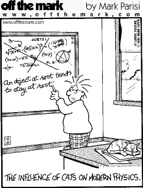

### 有趣的物理

最近发现了一些有趣的物理漫画

#### 1.

#### 2. 

#### 当然还有一些有趣的物理笑话：

1. The Stanford Linear Accelerator Center was known as SLAC, until the big earthquake, when it became known as SPLAC.
    SPLAC? Stanford Piecewise Linear Accelerator.

2. The answer to the problem was 'log(1+x)'. A student copied the answer from the good student next to him, but didn't want to make it obvious that he was cheating, so he changed the answer slightly, to 'timber(1+x)'

3. What is the difference between a physicist, an engineer, and a mathematician?

    If an engineer walks into a room and sees a fire in the middle and a bucket of water in the corner, he takes the bucket of water and pours it on the fire and puts it out.

    If a physicist walks into a room and sees a fire in the middle and a bucket of water in the corner, he takes the bucket of water and pours it eloquently around the fire and lets the fire put itself out.

    If a mathematician walks into a room and sees a fire in the middle and a bucket of water in the corner, he convinces himself there is a solution and leaves.

4. An experimental physicist performs an experiment involving two cats, and an inclined tin roof.

    The two cats are very nearly identical; same sex, age, weight, breed, eye and hair color.

    The physicist places both cats on the roof at the same height and lets them both go at the same time. One of the cats fall off the roof first so obviously there is some difference between the two cats.

    What is the difference?

    One cat has a greater mew
