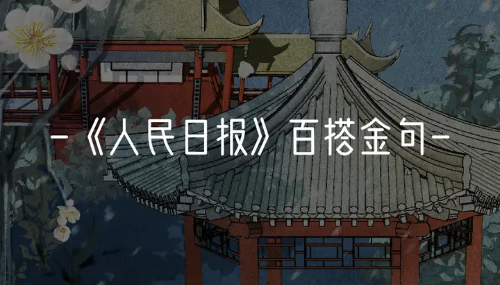

### 人民日报，10个百搭金句，写进作文赢麻了！

当代中学生至暗时刻：高级金句一箩筐，摘抄本记得满满当当，考试却写不了一点！

有句话说得好：素材在精不在多（没错，是纸条说的）。

在学生党心中封神的**人民日报**里，就藏着很多**简短易背、朗朗上口**的金句。

将它们写进作文，**一类文手到擒来！**

**芳华竞展，映照时代荣光。——《为推进中国式现代化作出巾帼贡献》**

**适用主题**

**女性力量、无私奉献**

**纸条示例**

**芳华竞展，映照时代荣光。**吴秋瑾从警二十九年，改造罪犯近两千名，罹患渐冻症后即使身体每况愈下，依旧坚守工作岗位；公益律师郭建梅为守护公平正义，义无反顾拿起法律武器，维护弱势群体合法权益，拉起了无数深陷泥泞的灵魂。她们为迷途者照亮希望的灯火，向彷徨者伸去援助的双手，捧出一颗无私奉献的心，不求流芳，只求以露水滋润干涸，薪火温暖寒夜。

**人间烟火气，最暖凡人心。——《拍到“语文课本封面”？文旅融合让诗和远方走到一起》**

**适用主题**

**崇敬英雄**

**纸条示例**

**人间烟火气，最暖凡人心，**寻常巷陌的袅袅炊烟，万里江山的岁月长安，我们能享受山河无恙的静好，那是因为有人负重前行，为我们守护祖国安宁。“海空卫士”王伟面对别国侦察机的侵犯，坚毅执行拦截任务，用生命捍卫国家主权；疾控首席吴尊友在疫情来袭时扛起重任，为人民带来了战胜疫情的信心。万家灯火明媚温暖，因为总有人张开臂膀为我们抵挡天灾人祸，用生命绘就人民安居乐业的蓝天。

**众力并则万钧举，人心齐则泰山移。——《团结凝聚力量，奋斗铸就伟业》**

**适用主题**

**团结协作**

**纸条示例**

**众力并则万钧举，人心齐则泰山移。**中国女篮在核心队员因伤缺阵的情况下，合心协力，勠力拼搏，战胜东道主队伍，挺进决赛，勇夺亚洲杯冠军；红杉树根浅浮地表，根基不牢，极易倒伏，但红杉成林，根根相连，无坚不摧，历经千年后依旧能屹立不倒。孤举者难起，众行者易趋。只有团结一心，全力以赴，才能抵御飓风骤雨，跨越山岳江海，行至约定的彼岸。

**前途一片光明，舞台无比广阔，奋斗正当其时。——《奋力跑好历史的接力棒》**

**适用主题**

**青年力量、奋斗拼搏**

**纸条示例**

当代青年，**前途一片光明，舞台无比广阔，奋斗正当其时。**90后女孩任纪兰，家境贫困但学习刻苦，考入师范大学后回乡成为一名教师，教书育人、资助学生；青年科学家黄芊芊潜心钻研芯片技术，为我国芯片事业的发展贡献了不可或缺的力量。身在当今时代，盛世中国，吾辈应将青春熔铸于伟大事业之中，奋勇迈进，立于舞台之上，聚光灯下，尽展少年英姿，谱写时代华章。

**守正为本，创新为要。——《守正创新，不脱实向虚》**

**适用主题**

**创新发展**

**纸条示例**

**守正为本，创新为要。**央视主持人朱广权为使新闻播报更加亲民讨喜，进行了多种转变尝试，收获了观众的青睐；著名京剧演员王珮瑜努力将京剧与现代传媒相结合，力图向公众传播京剧文化。酒香也怕巷子深，固步自封只会被时代遗弃，在抓好“本手”的基础上突破自我，创新发展，才能“妙手”生花。

**历史是城市独特的记忆，文化是城市流淌的血脉。——《“唤醒”老建筑，打卡多了好去处》**

**适用主题**

**家国情怀、历史记忆、文化传承**

**纸条示例**

**历史是国家独特的记忆，文化是国家流淌的血脉。**秦始皇一统六国，汉武帝开疆拓宇，唐太宗贞观之治，中国的历史源远流长；从春秋战国的百家争鸣，到唐宋元明的诗词歌赋，无论是儒家的仁义礼智，国画的水墨丹青，还是诗句的沉博绝丽，都深深地烙印在历史的悠悠岁月里，成为每一个中国人血脉中流淌的炙热，岁月轮转，历史不息，文脉不绝。

**大道至简，实干为要。——《振奋龙马精神，共同书写中国式现代化建设新篇章》**

**适用主题**

**匠心、实干**

**纸条示例**

**大道至简，实干为要。**“甜瓜奶奶”吴明珠年轻时在日记本中许诺为民服务，随即赴往新疆，潜心为瓜育种，毕尽一生留驻祖国西北，培育了数十种优质瓜种。不驰于空想，不骛于虚声。吴明珠在实干中完成了年少的承诺，让中国人民实现了“吃瓜自由”，同时为瓜农们带来了富裕的生活。

**饱蘸文化味，氤氲乡土气，乡村大集里最美的风景其实是人。——《蔬菜论捆、水果论堆、干果论兜……土味儿乡村大集为何圈粉？》**

**适用主题**

**乡土文化**

**纸条示例**

乡土从来不是抽象的符号，也不是蛮荒的恶土，它是清丽的山水，是低矮的草屋，是农忙的身影。**饱蘸文化味，氤氲乡土气，乡村大集里最美的风景其实是人。**穿粗布衣的姑娘手里忙着编蒲扇，皮肤黝黑的小伙子弓着身子割着草，房屋前的老人们嬉笑怒骂谈着天，乡间的人们总是有着“云淡风轻近午天，傍花随柳过前川”的惬意，总能感受到“梅子金黄杏子肥，麦花雪白菜花稀”的惊喜，他们漫步于田间阡陌，真挚地期许着一个丰收的季节，悠然地鲜活于乡野的沃土。

**行而不辍，未来可期。——《心始终连在一起》**

**适用主题**

**逆境拼搏**

**纸条示例**

钱红艳因为一场车祸失去双腿，只能用篮球支撑下半身行走，但她并未放弃生命的可能性，投身游泳运动事业。她直言训练艰辛，自己时常会哭泣，但她从未想过放弃，始终咬牙坚持，最终成为了多届残运会中收获奖牌的佼佼者。**行而不辍，未来可期，**面对困境，永远不停驻前行的脚步，才能在亦步亦趋中捕捉希望的曙光。

**昔日万人空巷，如今满目琳琅。——《你有多久没有打开电视机了？》**

**适用主题**

**科技发展、时代变迁**

**纸条示例**

随着时代的变迁，中国的科技发展一路高歌猛进、日新月异。小到生活中随处可见的存在，从电视到电脑，再到智能手机，**昔日万人空巷，如今满目琳琅。**大到上天入地万众瞩目的“巨兽”，从“嫦娥三号”登月，到“山东舰”下水，再到“天眼”落成，人民的生活在科技的进步中越来越便利多元，国家的未来在科技的腾跃中越来越璀璨光辉。

------

悄悄告诉你，以上内容均摘自**纸条APP**
